<div align="center">

# 🔍 VulnLens

**Turn messy vulnerability scanner output into one clean, trackable, reportable format.**

[](https://github.com/ua4157489-code/vulnlens/actions)
[](https://github.com/ua4157489-code/vulnlens/releases)

[](LICENSE)


[Quick Start](#-quick-start) · [How It Works](#-how-it-works) · [Screenshots](#-screenshots) · [Roadmap](#-roadmap) · [Contributing](#-contributing)

</div>

---

## 🎯 The Problem

Every security scanner speaks its own language. Nmap outputs one XML layout, OpenVAS another, ZAP a third. Comparing them, tracking fixes over time, or building one report means writing glue code again and again.

**VulnLens** reads results from multiple scanners, converts them into a single normalized data model, and gives you clean terminal summaries and JSON exports. The same issue always gets the same stable ID, so you can track what's new and what's fixed between scans.

## ✨ Features

| | Feature | Status |
|---|---|---|
| 🔌 | **Nmap XML** parser (open ports, services, script findings) | ✅ v0.1 |
| 🔌 | **OpenVAS / Greenbone XML** parser (CVSS, CVEs, remediation) | ✅ v0.1 |
| 🧠 | **Auto-detection** of scan format, no flags needed | ✅ v0.1 |
| 🎚️ | **Severity filtering** (`--min-severity`) | ✅ v0.1 |
| 📤 | **JSON export** of normalized findings | ✅ v0.1 |
| 🆔 | **Stable finding IDs** for cross-scan tracking | ✅ v0.1 |
| 🛡️ | **XXE-safe parsing** via `defusedxml`, proven by a test | ✅ v0.1 |
| 🗺️ | OWASP Top 10 and CWE mapping, risk scoring | 🔜 v0.2 |
| 📊 | HTML / Markdown reports with charts | 🔜 v0.3 |
| 🕒 | SQLite history and scan diffing | 🔜 v0.5 |

## 🚀 Quick Start

```bash
git clone https://github.com/ua4157489-code/vulnlens.git
cd vulnlens
python -m venv .venv && source .venv/bin/activate
pip install -e ".[dev]"

vulnlens parse tests/data/sample_openvas.xml
```

The bundled sample reports **1 Critical, 1 Medium and 1 Info finding across 2 assets**.

### Common commands

```bash
# Parse any supported scan file (format auto-detected)
vulnlens parse scans/nmap_lab.xml

# Show only Low severity and above
vulnlens parse scans/nmap_lab.xml --min-severity low

# Export normalized findings to JSON
vulnlens parse scans/nmap_lab.xml -o scans/nmap_lab.json

# Full help
vulnlens parse --help
```

## 🧩 How It Works

VulnLens is a pipeline: raw scanner files go in, one normalized model comes out, and every output format reads from that same model.

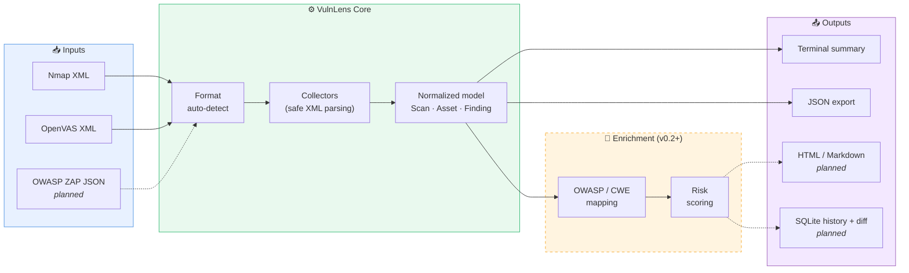

### What happens when you run `vulnlens parse`

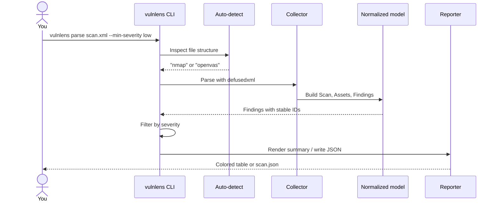

## 📸 Screenshots

### Quality gates: tests and lint

<table>
<tr>
<td width="50%"><b>Test suite passing</b><br>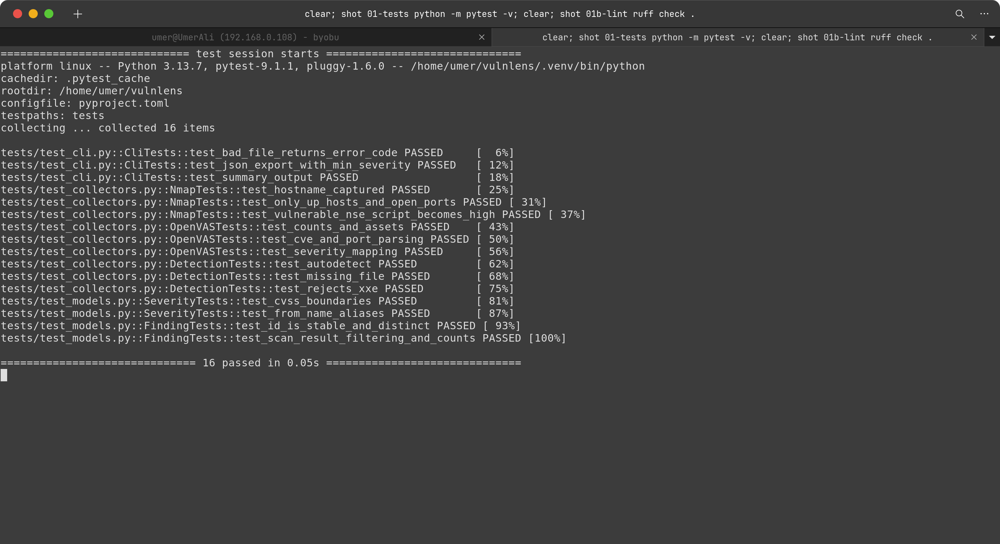</td>
<td width="50%"><b>Lint check (ruff)</b><br>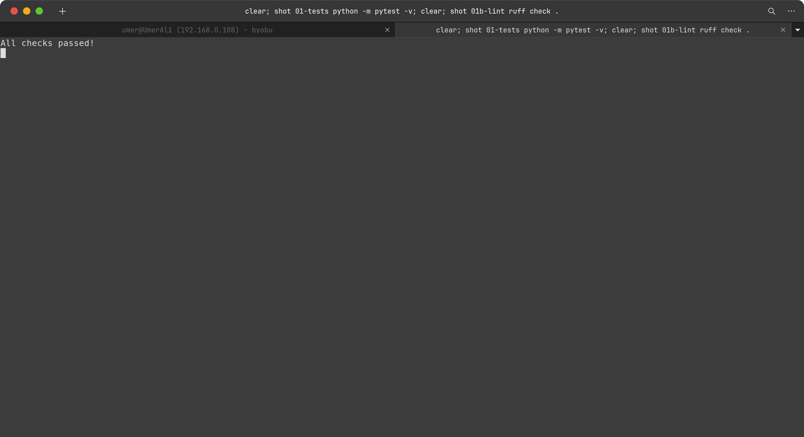</td>
</tr>
</table>

### The CLI

<table>
<tr>
<td width="50%"><b>Command help</b><br>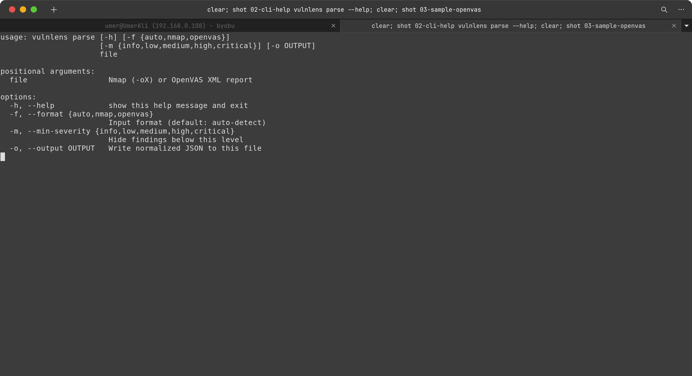</td>
<td width="50%"><b>Parsing a sample OpenVAS report</b><br>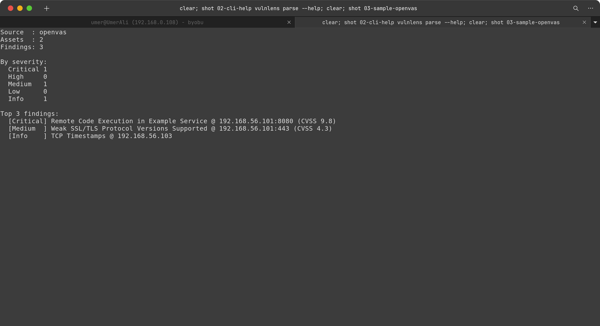</td>
</tr>
</table>

### Real-world test: scanning my own lab with Nmap

<table>
<tr>
<td width="50%"><b>1. Nmap service and vuln scan</b><br>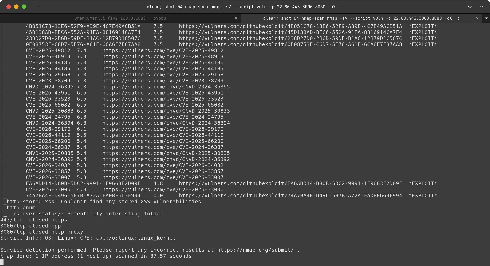</td>
<td width="50%"><b>2. Parsed into normalized findings</b><br>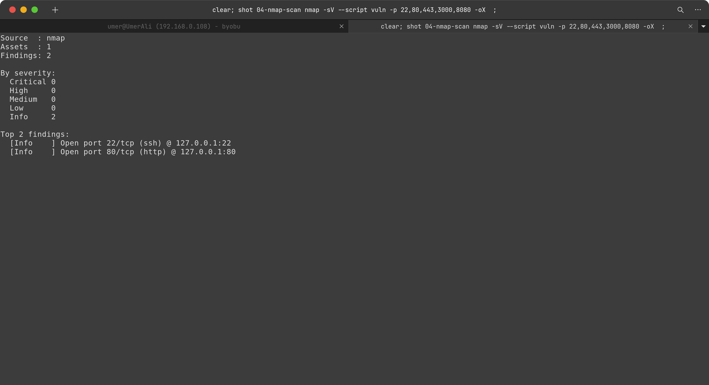</td>
</tr>
</table>

### Filtering and export

<table>
<tr>
<td width="50%"><b>Severity filter</b><br>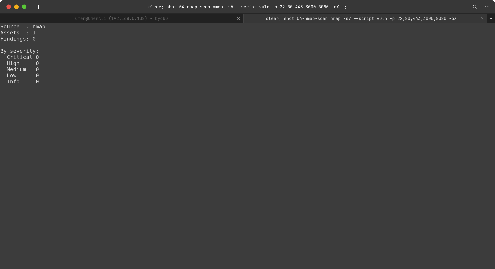</td>
<td width="50%"><b>JSON export</b><br>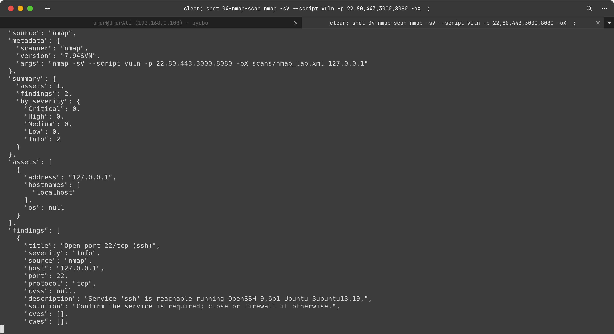</td>
</tr>
</table>

## 🏗️ Project Structure

```
vulnlens/
├── vulnlens/
│   ├── cli.py              # Command-line interface
│   ├── collectors/         # One parser per scanner (plugin-style)
│   │   ├── base.py
│   │   ├── nmap.py
│   │   └── openvas.py
│   ├── core/
│   │   └── models.py       # Scan, Asset, Finding
│   └── reporting/
│       ├── terminal.py     # Colored summary
│       └── json_export.py  # JSON output
├── tests/                  # pytest suite + sample scan files
├── docs/                   # Architecture + screenshots
├── examples/               # Sample output
└── .github/workflows/      # CI: lint + tests on every push
```

More detail in [docs/architecture.md](docs/architecture.md).

## 🛡️ Security by Design

A tool that parses untrusted files must not become the vulnerability itself.

- **XXE protection:** all XML goes through `defusedxml`. A test feeds it a malicious external-entity file and asserts it is rejected.
- **Read-only by nature:** VulnLens only parses and reports. It never launches scans or touches targets.
- **CI on every push:** linting and the full test suite run automatically.

Found a security issue? See [SECURITY.md](SECURITY.md).

## 🗺️ Roadmap

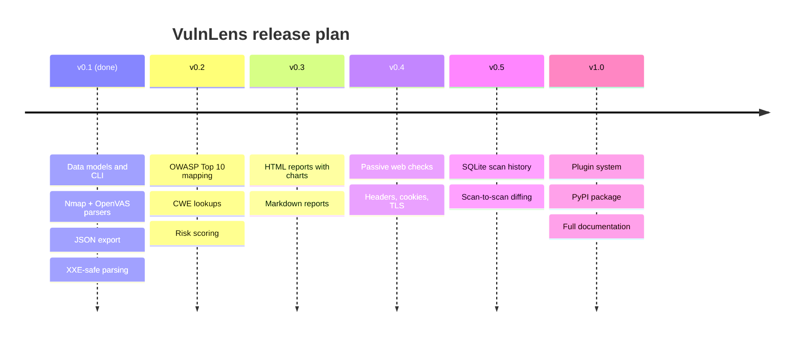

- [x] **v0.1**: Data models, CLI, Nmap + OpenVAS parsers, JSON output
- [ ] **v0.2**: OWASP Top 10 and CWE mapping, risk scoring
- [ ] **v0.3**: HTML and Markdown reports with charts
- [ ] **v0.4**: Passive web checks with authorized-target safeguards
- [ ] **v0.5**: SQLite history and "what's new / what's fixed" diffing
- [ ] **v1.0**: Plugin system, PyPI release, full docs

## ⚠️ Responsible Use

VulnLens processes scan data you provide. Only scan systems you own or have **explicit written permission** to test. The author is not responsible for misuse of this software or of the scanners whose output it reads.

## 🤝 Contributing

Contributions are welcome, whether it's a new collector, a bug fix, or documentation. Start with [CONTRIBUTING.md](CONTRIBUTING.md).

Good first contributions:
- Add a parser for a new scanner format (ZAP, Nikto, Nessus)
- Add more sample scan files to `tests/data/`
- Improve the terminal output

## 📄 License

Released under the [MIT License](LICENSE).

---

<div align="center">

**Built by [@ua4157489-code](https://github.com/ua4157489-code)**

If VulnLens is useful to you, consider giving it a ⭐

</div>
